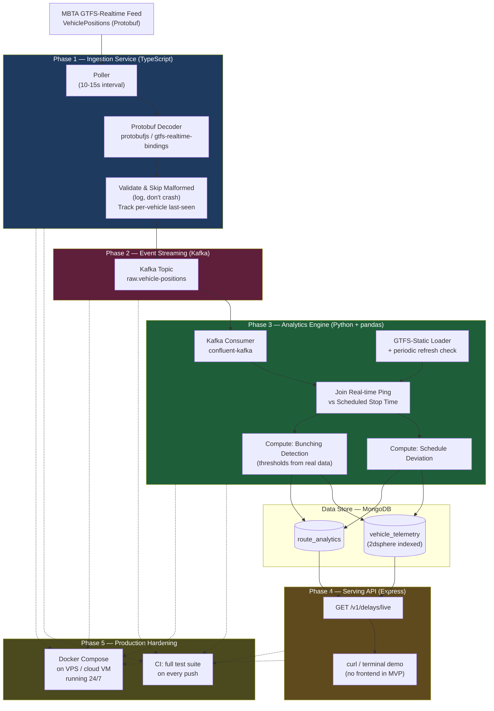

# GTFS Realtime Stream Engine

An event-driven pipeline that ingests, processes, and analyzes real-time public transit telemetry.

## Why This Project Exists

Most "real-time transit dashboard" projects call a pre-digested status API (like the ones provided by Transport For London or Bay Area Rapid Transit) and render it on a map. This one doesn't. It ingests **raw binary GTFS-Realtime feeds** (the actual protobuf format transit agencies publish), decouples ingestion from processing with **Kafka**, and computes its own delay and bunching metrics instead of trusting someone else's summary.

The goal is to build a real, working end-to-end event-driven system using real public data instead of mocked data — and to have something that actually runs continuously and produces real numbers, not just a diagram of what it would do. There is no frontend in this MVP: the pipeline itself (ingestion → streaming → analytics → API) is the product, and a `curl`/terminal demo against the live API will be the proof it works.

## Architecture Overview

```
                        [ MBTA GTFS-Realtime Feed ]
                                  │
                                  ▼
          ┌──────────────────────────────────────────────┐
          │     ingestion-service (TypeScript)           │
          │  - Polls MBTA feed on an interval            │
          │  - Decodes Protobuf → typed JSON             │
          │  - Validates & skips malformed entries       │
          │  - Publishes to Kafka                        │
          └───────────────────────┬──────────────────────┘
                                  │  (Kafka event stream)
                       ┌────────────────────────┐
                       │     Apache Kafka       │
                       │  raw.vehicle-positions │
                       └──────────┬─────────────┘
                                  │  (consumer group)
        ┌────────────────────────────────────────────────┐
        │     analytics-engine (Python + pandas)         │
        │  - Loads & periodically refreshes GTFS-static  │
        │  - Joins real-time pings against schedule      │
        │  - Computes delay & bunching metrics           │
        └───────────────────────┬────────────────────────┘
                                  │  (persisted metrics)
                       ┌────────────────────────┐
                       │       MongoDB          │
                       │  vehicle_telemetry     │
                       │  route_analytics       │
                       └──────────┬─────────────┘
                                  │
        ┌────────────────────────────────────────────────┐
        │       public-api (TypeScript / Express)        │
        │  - Serves computed delays & analytics          │
        │  - GET /v1/delays/live                         │
        └────────────────────────────────────────────────┘
                                  │
                          (curl / terminal demo —
                           no frontend in this MVP)
```

## Tech Stack

| Layer | Technology | Responsibility |
|---|---|---|
| Ingestion | TypeScript, Node.js, `protobufjs` or `gtfs-realtime-bindings` | Poll the MBTA GTFS-RT feed, decode binary Protobuf into typed objects, validate, publish to Kafka |
| Event Broker | Apache Kafka, Docker | Decouple ingestion cadence from analytics processing; buffer against feed hiccups |
| Analytics Engine | Python 3.11+, `confluent-kafka`, `pandas`, `shapely` | Join real-time pings against static schedule data, compute delay/bunching, explore the data before finalizing metrics |
| Data Store | MongoDB | Geospatially indexed (`2dsphere`) telemetry and analytics storage |
| Serving API | TypeScript, Node.js, Express | REST endpoint exposing computed metrics |
| Runtime | Docker Compose, small VPS/cloud VM | Full stack running continuously to test the code working in production |

## MVP Scope — What v1 Will Actually Cover

The MVP is scoped deliberately small and built in order, with each phase a working, demoable checkpoint on its own:

- **One transit agency, one feed type**: MBTA's `VehiclePositions` GTFS-Realtime feed — not the full GTFS-RT spec, not multiple agencies.
- **Two computed metrics** — schedule deviation (is a vehicle late, and by how much) and bunching detection (are two vehicles on the same route too close together) — not the full list of possible analytics. Bunching thresholds get decided from real MBTA data (see Phase 3).
- **One serving endpoint** (`GET /v1/delays/live`) before building out reliability history or bottleneck detection.
- **No frontend.** Proof of a working pipeline will be a `curl`/terminal demo against the live API, not a UI. A dashboard is real future work if there's ever a reason to build one (see Future Work) — it isn't part of this MVP.
- **Runs continuously, not just once.** The MVP isn't "done" until it's been deployed somewhere that stays up 24/7 and has collected real data over multiple days (see Phase 5).

Everything else (trip-update feeds, historical reliability windows, bottleneck clustering, a dashboard) is real future work, described at the end of this README, not part of the MVP.

## Build Phases

### Phase 1 — Ingestion Service (TypeScript)

**Goal: get real data flowing end-to-end as fast as possible, with real failure handling from day one.**

**Feed:** MBTA GTFS-Realtime `VehiclePositions` — https://www.mbta.com/developers/v3-api.

This phase polls the MBTA feed on an interval (every 10–15 seconds), decodes the raw Protobuf payload into a typed JSON object using `protobufjs`, and — deliberately, at this stage — writes it straight into MongoDB. No Kafka yet.

Skipping Kafka here isn't cutting a corner; it's intentional sequencing. The whole point of this phase is to get a fast feedback loop: see what a real feed actually looks like (field naming quirks, update frequency, how noisy the GPS coordinates are, how MBTA handles missing data) before making any decisions about how that data should be partitioned, buffered, or processed downstream. Adding Kafka before understanding the data would mean designing the event schema blind.

**Failure-mode behavior:**
- Malformed or partial feed entries are logged and skipped — one bad message never crashes the poller.
- After N consecutive poll failures (e.g. 5), log a clear error/alert rather than failing silently or retrying forever unnoticed.
- Track a per-vehicle last-seen timestamp so a vehicle that stops reporting mid-service can eventually be flagged as stale, not just silently absent (full silent-vehicle detection is future work — see below — but the timestamp needs to exist from Phase 1 so that data isn't missing retroactively).

**Testing & CI:**
- Unit tests that covers the Protobuf decode step against a captured sample payload (a saved fixture file), independent of live network access.
- GitHub Actions workflow runs that test suite on push.

**Acceptance criteria (pass/fail):**
- [ ] Polls the MBTA feed on interval without crashing for a sustained unattended run (target: 1 hour+). 
- [ ] Decodes raw Protobuf into typed JSON with zero unhandled decode exceptions across that run
- [ ] Malformed/partial entries are logged and skipped, never fatal
- [ ] Writes valid documents to MongoDB with correct `vehicle_id`, `trip_id`, `lat`/`lon`, `timestamp`
- [ ] Unit tests passes against a captured fixture payload
- [ ] CI workflow runs the test suite successfully on push

By the end of Phase 1, there should be a small but real collection of live vehicle position documents in MongoDB, pulled from MBTA, decoded from raw binary Protobuf — proof that the hardest part (talking to a real, undocumented-in-practice binary feed, with real failure handling) works.

### Phase 2 — Event Streaming Layer (Apache Kafka)

**Goal: introduce the decoupling layer, now that the data shape is understood.**

Once Phase 1 has produced real, inspected data, the ingestion service is refactored to publish to Kafka instead of writing directly to Mongo — `raw.vehicle-positions` as the first topic. Kafka sits between ingestion and everything downstream so that:

- Ingestion can keep polling at its own pace even if analytics processing is temporarily slow or down.
- A feed hiccup or MBTA outage doesn't take down anything else in the system.
- More consumers can be added later (an alerting service, a logging service, a second analytics variant) without ever touching the ingestion code again.

**Testing:** test that verifies a message published to `raw.vehicle-positions` matches the expected schema — catches a schema drift before it silently breaks the analytics engine in Phase 3.

**Acceptance criteria:**
- [ ] Ingestion service publishes decoded messages to `raw.vehicle-positions` instead of writing directly to Mongo
- [ ] A basic consumer can read and correctly parse messages off the topic
- [ ] CI runs both the decode test (Phase 1) and the schema test (Phase 2)

### Phase 3 — Analytics Engine (Python + pandas)

**Goal: turn raw pings into real signal — but let the real data decide what "signal" means.**

This is the computational core. On startup, the engine loads GTFS-static schedule files (`stops.txt`, `trips.txt`, `stop_times.txt`) into memory, indexed by `trip_id` and `stop_id`, so every incoming real-time ping can be matched against where that vehicle was *supposed* to be.

**GTFS-static refresh strategy:** static schedule files change over time (MBTA pushes schedule updates), so loading them once at startup risks silent drift over a multi-week run. The engine checks MBTA's schedule version/checksum on a recurring interval (e.g. once a day) and reloads the static data when it changes, instead of assuming it's fixed for the life of the process.

Before writing any production logic, this phase starts with exploration: pulling a batch of real Kafka messages into a `pandas` DataFrame and actually looking at it — how noisy is the GPS data, how often do updates arrive, what does a "normal" delay distribution look like versus an outlier. That exploration is what decides which metrics are actually worth computing, rather than guessing upfront.

The MVP settles on two:

- **Schedule deviation** — comparing a vehicle's actual position/timestamp against its scheduled stop time to compute how late (or early) it's running.
- **Bunching detection** — checking spatial proximity between consecutive vehicles on the same route; if two buses that should be evenly spaced are instead close together, that's a real, well-known transit operations problem, and a more interesting signal than delay alone. 

Note: **The distance and time-window thresholds that define "too close together" are decided here, from real inspected MBTA spacing/headway patterns — not guessed in advance.** For example: two vehicles on the same route/direction within X meters, where the actual headway ratio is below Y times the scheduled headway. Real X/Y values get set once the exploration step above has actually happened.

Computed results are written to MongoDB with a `2dsphere` geospatial index, so they can be queried by location later.

**Testing:** unit tests for the schedule-deviation calculation and the bunching-detection logic, run against fixed synthetic inputs with known expected outputs — this is where correctness matters most, since these numbers are the entire point of the project.

**Acceptance criteria:**
- [ ] GTFS-static data loads correctly and is queryable by `trip_id`/`stop_id`
- [ ] Static data refresh triggers correctly when the schedule version changes (can be tested with a manual version bump before relying on MBTA's real cadence)
- [ ] Schedule deviation is computed correctly for a known real trip, spot-checked by hand
- [ ] Bunching thresholds are set from real observed data, documented here in this README once decided
- [ ] Bunching detection correctly flags a known real bunched pair and does not flag a known well-spaced pair
- [ ] Unit tests for metrics pass in CI

### Phase 4 — Serving API (TypeScript / Express)

**Goal: expose the computed metrics over a clean REST contract, and prove the whole pipeline end-to-end.**

A thin Express API that reads from MongoDB and exposes it externally. The MVP ships exactly one endpoint:

- `GET /v1/delays/live` — current delay/bunching status for active vehicles.

Kept deliberately minimal so the full pipeline — ingest → stream → analyze → serve — is proven working end-to-end before expanding the API surface. `/v1/routes/:id/reliability` (historical punctuality) and `/v1/bottlenecks` (speed-drop clustering) are real, planned additions once the MVP loop is solid — see Future Work below.

**The demo, since there is no dashboard in this MVP:** a GIF ( via `asciinema`) showing `curl http://localhost:3000/v1/delays/live` returning real, live MBTA-derived delay/bunching data. That's the proof-of-work artifact for this project, not a UI.

**Testing:** an integration test that hits the endpoint against a seeded test database and checks the response shape and status code.

**Acceptance criteria:**
- [ ] `GET /v1/delays/live` returns real computed data from MongoDB
- [ ] Integration test covers the endpoint's response shape
- [ ] A recorded demo (terminal/GIF) exists showing the live endpoint returning real MBTA-derived data
- [ ] CI runs the full test suite (Phases 1–4) on every push

### Phase 5 — Production Hardening & 24/7 Runtime (final step)

**Goal: stop running this project on a laptop. Deploy it somewhere that stays up, and let it actually collect real history.**

Everything before this phase can be developed and demoed locally, but "let it run and collect history" needs somewhere to actually run continuously.

- **Deployment target:** a small VPS or free-tier cloud VM, running the full stack (ingestion, Kafka, analytics engine, MongoDB, API) via Docker Compose. 
- **CI/CD close-out:** by this point CI (started in Phase 1) should be running the full test suite from every phase on every push.
- **Containerization:**  extending it to build and push Docker images automatically so deployment is a `docker compose pull && up` away, not a manual rebuild.
- **Let it run.** Once deployed, leave it running for a sustained period so the "Where the Data Could Go From Here" ideas below have something real to eventually build on, and so this README's numbers (uptime, records processed, delays observed) can be reported as real measured results instead of hypothetical ones.

**Acceptance criteria:**
- [ ] Full stack deployed via Docker Compose on a VPS/cloud VM, not running locally
- [ ] Pipeline has run continuously and unattended for at least several consecutive days
- [ ] CI runs the complete test suite (all phases) on every push
- [ ] This README's Status section is updated with real numbers: uptime achieved, records processed, and a GIF demo

## Where the Data Could Go From Here

The MVP is deliberately narrow, but the pipeline underneath it produces data with a lot of future potential once it's actually running and collecting history:

- **Historical reliability scoring** — aggregating punctuality per route over rolling time windows, surfaced through `/v1/routes/:id/reliability`, to answer "is this route usually on time" rather than just "is it late right now."
- **Bottleneck detection** — clustering locations where vehicle speeds consistently drop, exposed through `/v1/bottlenecks`, useful for spotting recurring congestion points rather than one-off delays.
- **Prediction accuracy tracking** — GTFS-RT trip updates include MBTA's *own* predicted arrival times; comparing those predictions against what actually happened over time is a low-infrastructure way to measure how trustworthy the agency's own ETAs really are, without needing to train a model from scratch.
- **Full silent-vehicle / feed-gap detection** — Phase 1 tracks per-vehicle last-seen timestamps; a dedicated alerting pass on top of that (flagging a vehicle that's gone quiet mid-service) is often a more actionable signal than a vehicle that's simply running late.
- **A dashboard** — if there's ever a concrete reason to build one (e.g. demoing to a non-technical audience), a simple live map (e.g. via Leaflet) consuming `/v1/delays/live` on a polling interval. Deliberately not part of the MVP, the terminal/GIF demo already proves the pipeline works.
- **A public weekly reliability report** — once enough historical data accumulates, a simple scheduled job could publish a "which routes were least reliable this week" summary, turning the pipeline from a live view into an ongoing dataset with its own long-term value.

## Repository Structure

Two independent services connected by Kafka — not a single app, and not per-agency adapter classes(yet), since this MVP targets one feed (MBTA) end-to-end rather than a pluggable multi-city aggregator. Structure mirrors the phases above directly.

```
gtfs-realtime-stream-engine/
├── docker-compose.yml            # Kafka, MongoDB, both services — Phase 5 runtime
├── README.md
│
├── ingestion-service/             # Phases 1, 2, 4 — TypeScript
│   ├── package.json
│   ├── tsconfig.json
│   ├── .env                       # MBTA_API_KEY, MongoDB URI, Kafka broker (gitignored)
│   ├── src/
│   │   ├── index.ts                # Entry point: starts poller + Express API
│   │   ├── config.ts               # Poll interval, MBTA key, Mongo URI, Kafka broker
│   │   │
│   │   ├── proto/                    # The contract of the proto data
│   │   │   └── gtfs-realtime.proto        # GTFS Realtime Specification given by Google at github.com/google/transit/tree/master/gtfs-realtime
│   │   │
│   │   ├── generated/                    # Files generated using protobufjs-cli
│   │   │   ├── gtfs-realtime.js          # Static JavaScript file used to encode and decode the MBTA binary data
│   │   │   └── gtfs-realtime.d.ts        # TypeScript definitions
│   │   │
│   │   ├── ingestion/
│   │   │   ├── poller.ts           # Polls MBTA feed on interval (Phase 1)
│   │   │   ├── decoder.ts          # Protobuf → typed JSON (protobufjs)
│   │   │   ├── validator.ts        # Validate & skip malformed entries; track per-vehicle last-seen
│   │   │   └── producer.ts         # Publishes to Kafka raw.vehicle-positions (Phase 2; Phase 1 writes to Mongo directly instead)
│   │   │
│   │   ├── db/
│   │   │   ├── connection.ts       # MongoDB connection
│   │   │   └── vehicle-telemetry.model.ts
│   │   │
│   │   ├── api/
│   │   │   ├── server.ts           # Express app (Phase 4)
│   │   │   └── routes/
│   │   │       └── delays.ts       # GET /v1/delays/live
│   │   │
│   │   └── utils/
│   │       └── logger.ts           # Structured logging (poll failures, decode errors)
│   │
│   └── tests/
│       ├── decoder.test.ts         # Phase 1 — decode fixture payload
│       ├── producer.test.ts        # Phase 2 — schema published to Kafka
│       └── api/
│           └── delays.test.ts      # Phase 4 — integration test, seeded test DB
│
├── analytics-engine/               # Phase 3 — Python
│   ├── pyproject.toml (or requirements.txt)
│   ├── .env                        # Mongo URI, Kafka broker (gitignored)
│   ├── src/
│   │   ├── main.py                 # Entry point: starts Kafka consumer loop
│   │   ├── config.py
│   │   │
│   │   ├── consumer.py             # Kafka consumer (confluent-kafka), reads raw.vehicle-positions
│   │   ├── gtfs_static/
│   │   │   ├── loader.py           # Loads stops.txt / trips.txt / stop_times.txt into memory
│   │   │   └── refresh.py          # Periodic schedule-version check & reload
│   │   │
│   │   ├── metrics/
│   │   │   ├── schedule_deviation.py
│   │   │   └── bunching.py         # Thresholds set from real MBTA data exploration
│   │   │
│   │   └── db/
│   │       └── writer.py           # Writes computed metrics to MongoDB (2dsphere indexed)
│   │
│   ├── notebooks/
│   │   └── exploration.ipynb       # Phase 3 exploration step: DataFrame inspection before finalizing metrics
│   │
│   └── tests/
│       ├── test_schedule_deviation.py
│       └── test_bunching.py        # Synthetic fixed inputs, known expected outputs
│
├── docs/
│   └── demo.gif                    # Phase 4 — recorded curl/terminal demo (no frontend in this MVP)
│
└── .github/
    └── workflows/
        └── ci.yml                  # Runs both services' test suites on every push (Phase 1 onward)
```

**Why two services and not one:** the whole architectural point of this project is that ingestion (TypeScript, I/O-bound polling) and analytics (Python, pandas/data-shape work) are genuinely different workloads decoupled by Kafka. `ingestion-service` also owns the serving API (Phase 4), since it's the same runtime that already talks to MongoDB and Express; there's no reason to add a third service just to expose one endpoint.

**Why no `adapters/` directory:** an earlier draft of this plan considered a pluggable adapter pattern for multiple transit agencies (TfL, BART, MBTA, CTA, etc.). That's explicitly out of scope for this MVP — one feed, done well, is the point (see MVP Scope above). If a second agency is ever added as real future work, `ingestion/poller.ts` and `decoder.ts` are the two files that would need an interface extracted from them at that time — not before there's a second real implementation to justify it.

## Data Flow Diagram



*(Dashed arrows show CI and deployment applying across all four build phases, closed out in Phase 5.)*

## Status

🚧 Early build — Phase 1 in progress. Feed selected (MBTA). Ready to implement per the phases above.
