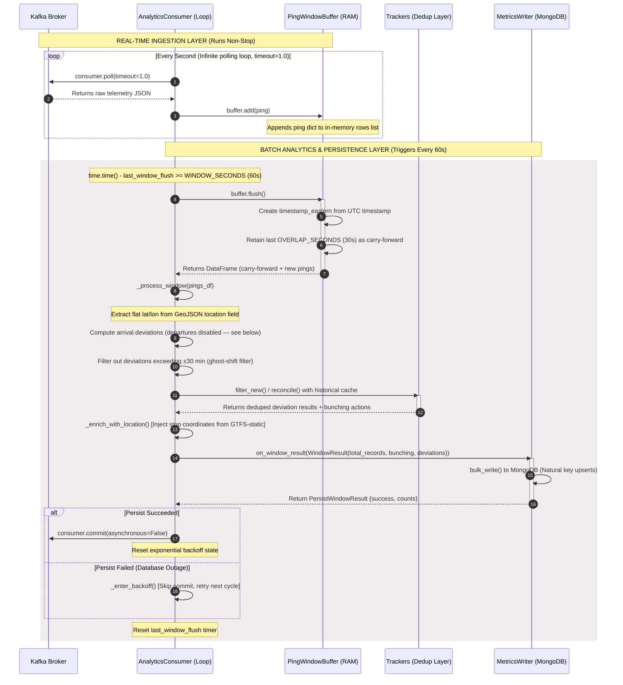

# Analytics Engine Processing Cycle

## Introduction

This document explains how the analytics engine consumes raw vehicle telemetry from Kafka, computes schedule deviations and bunching events, and persists the results to MongoDB. The engine runs as a single continuous process with two interleaved loops: a real-time ingestion loop that polls Kafka every second, and a batch analytics loop that processes accumulated pings every 60 seconds.

The design draws from the notebooks in `analytics-engine/notebooks/`, where the metrics were first explored against collected MBTA data before being productionized into the consumer.

## Processing Cycle Overview



## Real-Time Ingestion Layer

The consumer polls Kafka with `consumer.poll(timeout=1.0)`, which blocks for up to one second waiting for a message. Every message received is parsed as JSON and appended to the `PingWindowBuffer`'s in-memory row list. This loop runs indefinitely — it never stops between windows.

The poll timeout is deliberately short (1 second) so the consumer stays responsive to Kafka heartbeats and rebalance events, even during the 60-second gap between processing windows.

## PingWindowBuffer and the Overlap Strategy

The buffer implements a **time-windowed with overlap** strategy (explained in detail in `consumer.py`'s module docstring). Each window:

1. **Flushes** all accumulated pings into a DataFrame.
2. **Creates `timestamp_eastern`** by converting the UTC `timestamp` field from the ingestion service via `to_eastern()`.
3. **Carries forward** the last `OVERLAP_SECONDS` (30 seconds) of pings into the next window.

The carry-forward exists because a bunching event that starts near the end of one window and continues into the next would otherwise be split across two batches. Neither batch alone might have enough consecutive observations to cross the `MIN_CONSECUTIVE_OBSERVATIONS` threshold (2), causing the event to be silently missed. The overlap ensures boundary-crossing events are visible in full in at least one window.

The trade-off is that overlapping pings get reprocessed. This is handled by the dedup trackers (see below), not by trying to avoid reprocessing.

## GeoJSON Coordinate Extraction

The ingestion service publishes vehicle location as a GeoJSON object:

```json
{"type": "Point", "coordinates": [-71.1425, 42.3954]}
```

GeoJSON stores coordinates as `[longitude, latitude]`. The bunching module expects flat `lat` and `lon` columns. `_process_window` extracts these before passing the DataFrame to `find_close_pairs`:

```python
pings["lat"] = pings["location"].apply(lambda loc: loc["coordinates"][1] ...)
pings["lon"] = pings["location"].apply(lambda loc: loc["coordinates"][0] ...)
```

## Schedule Deviation Computation

The engine computes **arrival deviations only** — departure deviations are currently disabled.

**Why arrival-only:** `compute_arrival_deviations()` uses a validated first-arrival collapsing technique (explored in notebook 03, Section E): repeated `STOPPED_AT` pings for the same `(vehicle, trip, stop_sequence)` are collapsed to the earliest observed timestamp, preventing long dwell times from inflating the apparent lateness.

`compute_departure_deviations()` uses the opposite heuristic — the **last** `STOPPED_AT` ping before a vehicle transitions away — but this technique was never validated against real data. It is disabled pending the same empirical check that arrival collapsing received. The comment in `_process_window` documents the three steps needed to re-enable it.

**Ghost-shift filter:** after computing deviations, any result with `|deviation_seconds| > 30 minutes` (1,800 seconds) is dropped. Real MBTA bus deviations rarely exceed 15 minutes; the outliers (30-43 min) were traced to single vehicles running on misaligned schedules — a schedule-matching problem, not real lateness. The filter logs how many deviations were dropped per window.

## Bunching Detection

Bunching detection runs on the full ping DataFrame (not just pings with `stop_id`), since proximity matters at any point along a route, not just at stops.

1. **`find_close_pairs`** generates candidate vehicle pairs that share the same `(route_id, direction_id, time_bucket)`, then computes equirectangular distance. Pairs within `DISTANCE_THRESHOLD_METERS` (100m, ~5-8 bus-lengths) survive.

2. **`detect_bunching_events`** collapses consecutive-bucket close-pair observations into discrete events. Only runs with `observation_count >= MIN_CONSECUTIVE_OBSERVATIONS` (2 consecutive poll cycles, i.e., 30 seconds of sustained proximity) are emitted. A single close ping does not count.

3. **`_BunchingEventTracker`** deduplicates across overlapping windows. If the same vehicle pair was already seen, it emits an `"update"` action (extended `end_time`) rather than a duplicate `"new"` event.

## Dedup Trackers

The overlap strategy means the same pings appear in two consecutive windows. Two in-memory trackers prevent duplicates from reaching MongoDB:

- **`_BunchingEventTracker`**: keyed by `(route_id, direction_id, vehicle_a, vehicle_b)`. Tracks whether an event is new, an update (growing `end_time`), or already fully emitted.
- **`_DeviationResultTracker`**: keyed by `(vehicle_id, trip_id, stop_sequence, kind)`. Arrival collapsing is idempotent, so a plain dedup-by-key suffices.

Both trackers have a retention period (`TRACKER_RETENTION_SECONDS = 600s`) after which entries are purged to bound memory growth.

## Location Enrichment

After the tracker filters the deviations, `_enrich_with_location` attaches a GeoJSON `location` field to each result using the GTFS-static `stops_lookup`. The enrichment is best-effort: if a stop has no coordinates in `stops.txt`, the deviation is still emitted with `location: null`.

The enriched location enables MongoDB's `2dsphere` geospatial index on `schedule_deviations.location`, which supports future queries like "show all delays near this stop."

## MongoDB Persistence

`MetricsWriter.persist_window()` writes bunching events and schedule deviations in separate `bulk_write` calls with `ordered=False`:

- **Bunching events** are upserted on `(route_id, direction_id, vehicle_a, vehicle_b, start_time)`. An "update" action overwrites `end_time`, `observation_count`, and `min_distance_meters` in place.
- **Schedule deviations** are upserted on `(vehicle_id, trip_id, stop_sequence, kind)`.

Both use idempotent upserts so that at-least-once delivery (from the commit-gating guarantee) doesn't produce duplicates on retry.

`persist_window` returns `{success, bunching_written, deviations_written, ...}`. Success means `bulk_write` completed without throwing a `PyMongoError` — a matched-but-not-modified document (overlap reprocessing an identical event) counts as success, not a partial write.

## Commit Gating and Exponential Backoff

The consumer only commits the Kafka offset after a successful persist. This is the core of the at-least-once delivery guarantee (see `docs/guarantees.md`).

If the persist fails:
1. The offset is **not** committed — Kafka will redeliver the messages on restart.
2. The consumer enters **exponential backoff**: it continues polling Kafka (maintaining consumer-group membership) but skips persist attempts for an increasing delay.
3. Backoff starts at `MONGO_RETRY_BASE_SECONDS` (1s) and doubles each failure, capped at `MONGO_RETRY_MAX_SECONDS` (60s), with random jitter to avoid thundering herd.
4. When a persist succeeds, the backoff resets and normal operation resumes.

During backoff, the overlap buffer retains only the last `OVERLAP_SECONDS` of pings, so intermediate data from the deepest backoff period may be replayed from Kafka on restart rather than processed inline.

## GTFS-Static Refresh

The engine loads GTFS-static schedule files (`stops.txt`, `trips.txt`, `stop_times.txt`) into memory at startup. Every `GTFS_REFRESH_INTERVAL_SECONDS` (24 hours), it:

1. Calls `download_and_extract_gtfs()` to check MBTA's ETag and download a new ZIP if the remote bundle changed.
2. Calls `reload_if_changed()` to detect if the on-disk files differ from the loaded snapshot (via `feed_info.txt` version or file fingerprint).
3. If changed, atomically reloads all lookups — the previous snapshot remains valid until the new one is fully loaded.

The download and reload are intentionally decoupled: the refresh module doesn't know about CSV parsing, and the loader doesn't know about HTTP.

## Current Configuration Constants

| Constant | Value | Rationale |
|---|---|---|
| `WINDOW_SECONDS` | 60 | Batch processing interval |
| `OVERLAP_SECONDS` | 30 | `MIN_CONSECUTIVE_OBSERVATIONS × POLL_INTERVAL_SECONDS` |
| `POLL_INTERVAL_SECONDS` | 15 | Matches `BASE_INTERVAL_MS` in `poller.ts` |
| `DISTANCE_THRESHOLD_METERS` | 100 | ~5-8 bus-lengths; set from notebook 04 sensitivity sweep |
| `MIN_CONSECUTIVE_OBSERVATIONS` | 2 | 30 seconds of sustained proximity |
| `MAX_DEVIATION_SECONDS` | 1,800 (30 min) | Ghost-shift filter; 99.6% of real deviations fall within ±15 min |
| `TRACKER_RETENTION_SECONDS` | 600 | 10× window; bounds memory growth |
| `GTFS_REFRESH_INTERVAL_SECONDS` | 86,400 (24h) | Matches MBTA's typical schedule update cadence |