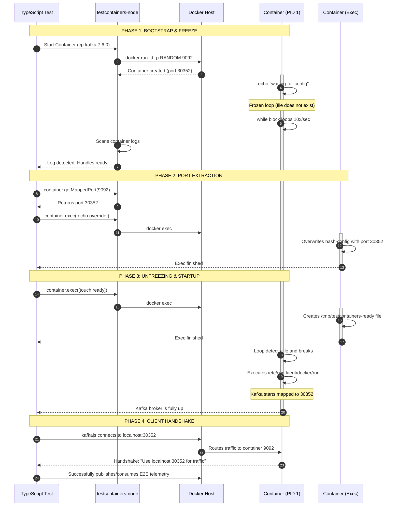

# Kafka Integration Test Architecture (testcontainers-node)

## Introduction
This document explains the synchronization mechanism implemented in TypeScript integration tests of `ingestion-service`. 

Testing Kafka locally using Docker containers with dynamic ports poses a challenge: Kafka must know its external hostname and mapped port (`KAFKA_ADVERTISED_LISTENERS`) **before** it boots up. However, `testcontainers` only knows which random port Docker assigned **after** the container has already started.

To solve this chicken-and-egg problem, it was implemented a **Readiness Gate Strategy**:
1. The container's entrypoint is intercepted, freezing its main process in a custom `while` loop upon startup.
2. While frozen, it is extracted the dynamically mapped port from the host.
3. Execute a parallel backdoor process (`docker exec`) to inject the correct runtime configuration.
4. A sentinel file is created to release the gate, allowing Kafka to initialize with the correct network metadata.

## Execution Sequence Lifecycle

