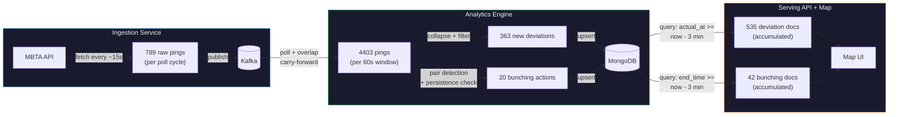

# Number Flow: Why Each Layer Shows Different Counts

## Introduction

When looking at the system in real time, three different numbers appear for what seems like the same metric. The following numbers were taken from a session, so they are being used as real examples:

- **Ingestion service**: "789 records published"
- **Analytics engine**: "4403 records examined, 363 deviation results, 20 bunching actions"
- **Map UI**: "535 deviations, 42 bunching events"

Nobody is wrong about the information they are showing. Each layer measures at a different stage and time granularity. This document traces every number through the pipeline so the relationship is clear.

## Pipeline Overview



## Stage-by-Stage Breakdown

### Stage 1 — Ingestion: 789 raw pings

The ingestion service polls MBTA's GTFS-Realtime feed every ~15 seconds (`BASE_INTERVAL_MS` in `poller.ts`). Each poll decodes the protobuf response, validates the pings, and publishes them to the `raw.vehicle-positions` Kafka topic.

**789** is the count of individual vehicle-position records from a single poll cycle. It represents one snapshot of the fleet at that instant.

### Stage 2 — Analytics Window: 4403 records examined

The analytics engine does NOT process one poll at a time. It accumulates pings into a **60-second time window** (`WINDOW_SECONDS = 60` in `consumer.py`). To avoid missing bunching events that span window boundaries, it also carries forward the last 30 seconds of pings from the previous window (`OVERLAP_SECONDS = 30`).

So the DataFrame processed each window contains:

| Source | Approximate pings |
|---|---|
| New pings (~4 poll cycles × 789) | ~3,156 |
| Overlap carry-forward (~2 poll cycles × 789) | ~1,578 |
| **Theoretical total** | **~4,734** |
| **Actual (dedup, timing jitter)** | **4,403** |

**4403** is the total pings in the combined (carry-forward + new) DataFrame. It is intentionally larger than any single poll's output.

### Stage 3 — Deviation Computation: 363 new deviations

From those 4403 pings, schedule deviations are computed as follows:

1. **Filter**: exclude pings with no `stop_id` (shuttle/generic trips with no schedule).
2. **Collapse**: multiple `STOPPED_AT` pings for the same `(vehicle_id, trip_id, stop_sequence)` become one first-arrival observation (`collapse_to_first_arrival`).
3. **Match**: each arrival is looked up against `stop_times.txt` to get the scheduled time.
4. **Threshold**: deviations beyond ±30 minutes are rejected as ghost-shift outliers.
5. **Deduplicate**: the in-memory `_DeviationResultTracker` filters out any `(vehicle_id, trip_id, stop_sequence, kind)` already seen in the last 10 minutes.

**363** is the count that survived all five filters — genuine, previously-unseen arrival events in this window.

### Stage 4 — Bunching Detection: 20 bunching actions

From the same 4403 pings:

1. **Pair**: self-join pings sharing the same `(route_id, direction_id, time_bucket)` to find candidate vehicle pairs.
2. **Distance**: compute equirectangular distance; keep pairs within 100 meters.
3. **Persistence**: require at least 2 consecutive 15-second poll buckets where the pair stays close.
4. **Reconcile**: the in-memory `_BunchingEventTracker` checks each detected event against its cache:
   - Never seen → `"new"` action
   - Seen before, event still growing → `"update"` action
   - Seen before, no change → skipped

**20** is the number of new + update actions that the tracker decided are worth persisting in this window.

### Stage 5 — MongoDB Accumulation: 535 deviations, 42 bunching events

The serving API (`/v1/status/live` in `status.ts`) queries MongoDB with a **3-minute rolling lookback** (`LIVE_WINDOW_MS = 3 × 60 × 1000`):

```typescript
// deviations: all docs where the vehicle actually arrived within the last 3 min
{ actual_at: { $gte: cutoff } }

// bunching: all docs where the event's end_time is within the last 3 min
{ end_time: { $gte: cutoff } }
```

This is **not per-window**: it is the **accumulated total** of all documents written by multiple consecutive windows that still fall within the 3-minute lookback.

With windows processing every 60 seconds and a 3-minute lookback, roughly 3 windows' worth of data contributes:

| Metric | Per window | × ~3 windows | Accumulated (map) |
|---|---|---|---|
| Deviations | 363 new | ~1,089 possible | **535** (many overlap — same vehicle, different stops across windows) |
| Bunching | 20 actions | ~60 possible | **42** (many are "updates" to existing events, not new documents; some aged out) |

The accumulated numbers are lower than a naive `per_window × 3` because:

- **Deviations**: MongoDB upserts on `(vehicle_id, trip_id, stop_sequence, kind)`. The same vehicle arriving at the same stop across multiple windows is ONE document, not three. The dedup is persistent (database-level), not just in-memory.
- **Bunching**: many of the 20 actions per window are `"update"` actions that modify an existing document's `end_time` rather than inserting a new one. And events whose `end_time` falls outside the 3-minute window are excluded from the API response.

## Summary Table

| Number | Where | What it counts | Time scope |
|---|---|---|---|
| 789 | Ingestion log | Raw pings published to Kafka | One ~15s poll cycle |
| 4403 | Analytics log | Pings in the processing DataFrame | One 60s window (with overlap) |
| 363 | Analytics log | New deviation results from this window | One 60s window (after dedup) |
| 20 | Analytics log | Bunching actions (new + update) from this window | One 60s window (after reconciliation) |
| 535 | Map / API | Deviation documents in MongoDB | Accumulated over 3-minute lookback |
| 42 | Map / API | Bunching documents in MongoDB | Accumulated over 3-minute lookback |

## Key Insight

The ingestion service counts **raw input**, the analytics engine counts **per-window processing output**, and the map counts **accumulated database state**. They are three different measurements at three different points in the pipeline, each correct for its own scope.
