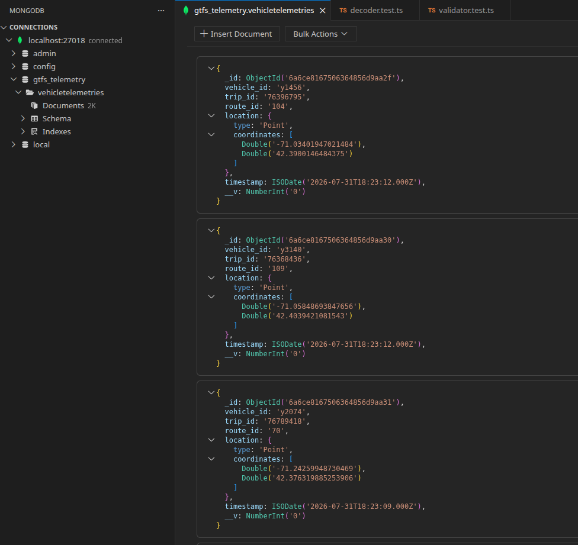
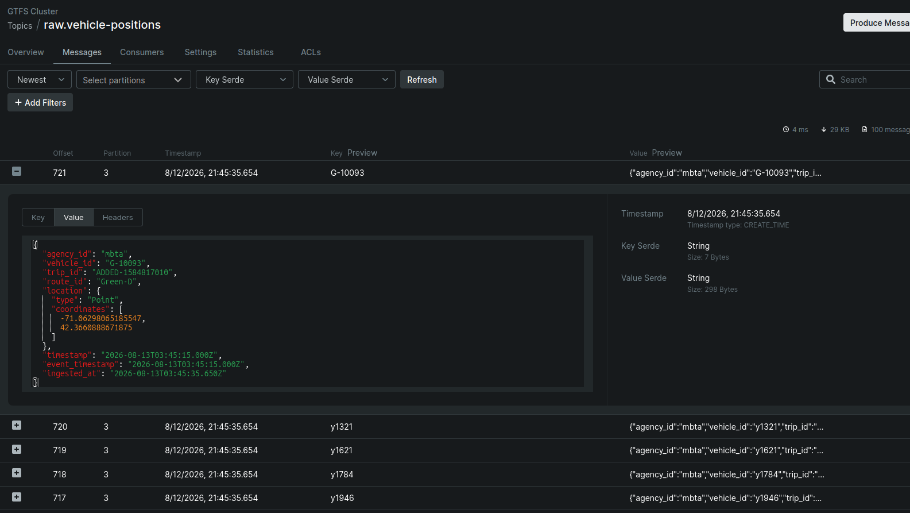
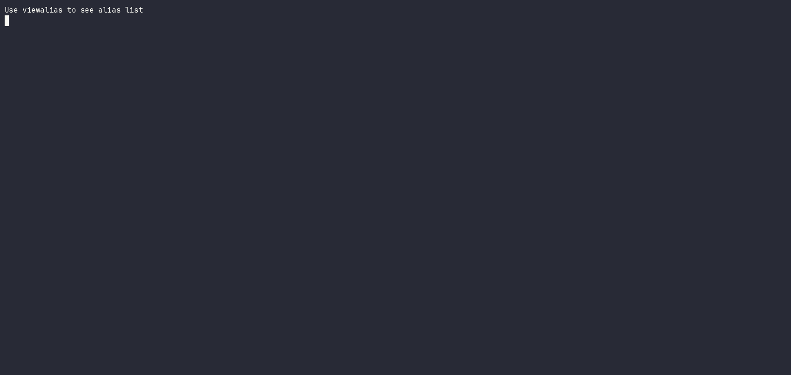
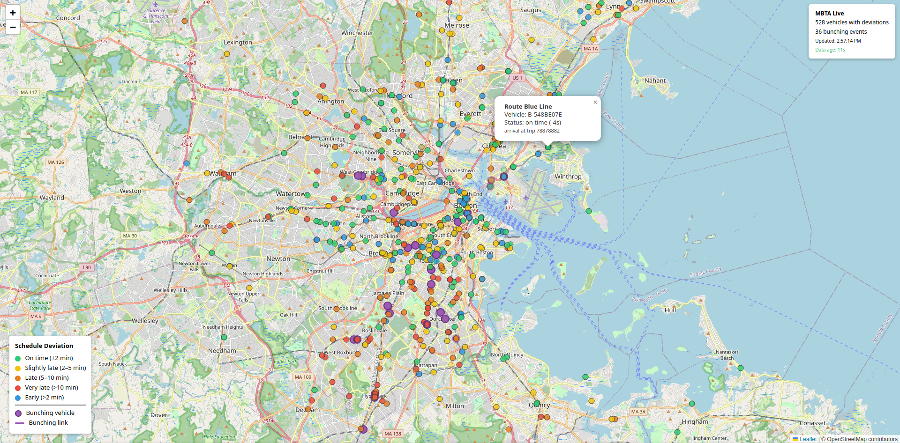
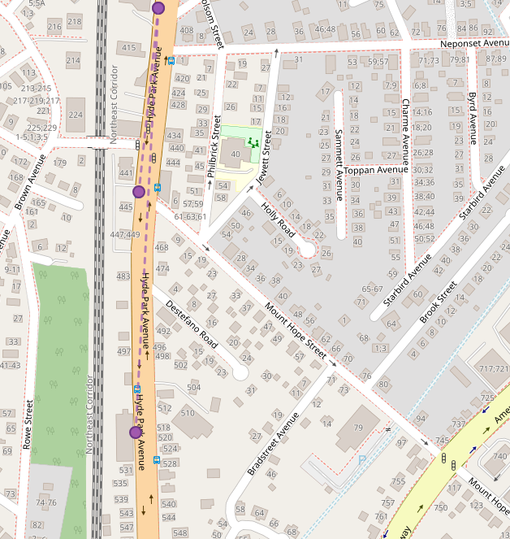
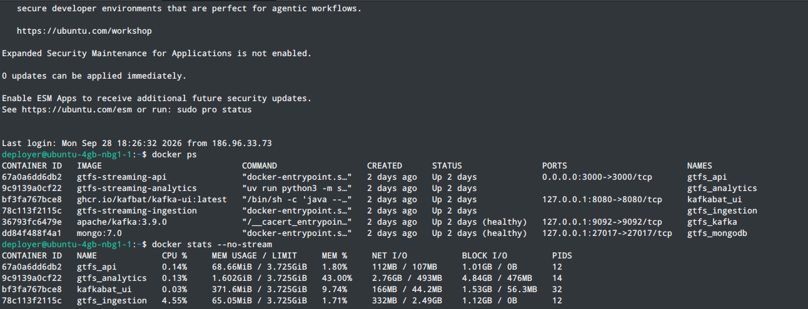
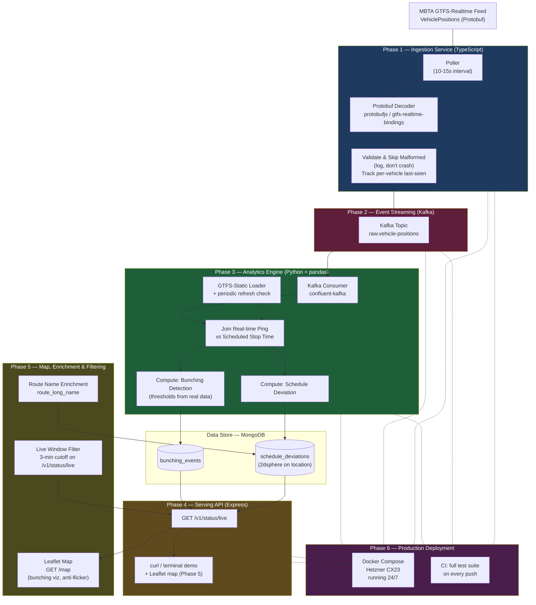

# Build Phases — Detailed Documentation

This document contains the detailed implementation notes, acceptance
criteria, and testing breakdowns for each build phase. For a high-level
overview, see the [README](../README.md).

---

## Phase 1 — Ingestion Service (TypeScript)

**Goal: get real data flowing end-to-end as fast as possible, with real failure handling from day one.**

**Feed:** MBTA GTFS-Realtime `VehiclePositions` — https://cdn.mbta.com/realtime/VehiclePositions.pb

This phase polls the MBTA feed on a 15-second interval, decodes the raw Protobuf payload into a typed JSON object using `protobufjs`, and writes it straight into MongoDB. No Kafka yet.

Skipping Kafka here isn't cutting a corner; it's intentional sequencing. The whole point of this phase is to get a fast feedback loop: see what a real feed actually looks like before making any decisions about how that data should be partitioned, buffered, or processed downstream.

**Implementation Details:**
- **Validation:** Enforces strict GeoJSON formatting and drops vehicles lacking mandatory coordinates or IDs to ensure clean data for downstream analytics.
- **Idempotency:** Implements a MongoDB Compound Unique Index (`vehicle_id` + `timestamp`) combined with unordered `bulkWrite()` operations. This ensures that feed hiccups (MBTA broadcasting the exact same payload twice) are silently deduplicated at the database level without crashing the ingestion loop.
- **Observability:** Replaced standard console logs with `pino` for structured, leveled JSON logging.
- **Failure-mode behavior:**
  - Malformed or partial feed entries are logged and skipped — one bad message never crashes the poller.
  - After 5 consecutive poll failures, the poller triggers a `fatal` alert log rather than failing silently or retrying forever unnoticed.

**Testing & CI:**
- Unit tests written in `vitest` cover the Protobuf decode step and validation logic against a captured sample payload (`fixtures/mbta_feed.pb`), independent of live network access.
- GitHub Actions workflow runs the test suite on every push.

**Acceptance criteria:**
- [x] Polls the MBTA feed on interval without crashing for a sustained unattended run (target: 1 hour+)
- [x] Decodes raw Protobuf into typed JSON with zero unhandled decode exceptions across that run
- [x] Malformed/partial entries are logged and skipped, never fatal
- [x] Writes valid documents to MongoDB with correct `vehicle_id`, `trip_id`, `lat`/`lon`, `timestamp`
- [x] Unit tests passes against a captured fixture payload
- [x] CI workflow runs the test suite successfully on push

By the end of Phase 1, there should be a small but real collection of live vehicle position documents in MongoDB, pulled from MBTA, decoded from raw binary Protobuf — proof that the hardest part (talking to a real, undocumented-in-practice binary feed, with real failure handling) works.

#### Live Demo

*Live ingestion logs filtering duplicates and malformed data.*

*VSCode MongoDB extension showing the 2dsphere indexed telemetry documents.*

---

## Phase 2 — Event Streaming Layer (Apache Kafka)

**Goal: introduce the decoupling layer, now that the data shape is understood.**

Once Phase 1 has produced real, inspected data, the ingestion service is refactored to publish to Kafka instead of writing directly to Mongo — `raw.vehicle-positions` as the first topic. Kafka sits between ingestion and everything downstream so that:

- Ingestion can keep polling at its own pace even if analytics processing is temporarily slow or down.
- A feed hiccup or MBTA outage doesn't take down anything else in the system.
- More consumers can be added later (an alerting service, a logging service, a second analytics variant) without ever touching the ingestion code again.

It is relevant to mention that this phase **does not keep track** of duplicated records as the phase 1 due the way Kafka works. The responsibility has moved downstream, and the consumer functions will verify these cases.

**Testing:** test that verifies a message published to `raw.vehicle-positions` matches the expected schema — catches a schema drift before it silently breaks the analytics engine in Phase 3.

**Acceptance criteria:**
- [x] Ingestion service publishes decoded messages to `raw.vehicle-positions` instead of writing directly to Mongo
- [x] A basic consumer can read and correctly parse messages off the topic
- [x] CI runs both the decode test (Phase 1) and the schema test (Phase 2)

#### Live Demo

*Starts the GTFS streaming stack with Docker Compose, waits for Kafka to become healthy, then launches the ingestion service, continuously publishing MBTA vehicle telemetry.*

*Runs the Kafka round-trip integration test against the real broker. A test telemetry message is published through the production Kafka pipeline, consumed from raw.vehicle-positions, parsed as JSON, and validated against the expected schema.*

*Kafbat UI showing the raw.vehicle-positions Kafka topic populated with telemetry messages.*

---

## Phase 3 — Analytics Engine (Python + pandas)

**Goal: turn raw pings into real signal — but let the real data decide what "signal" means.**

This is the computational core. On startup, the engine loads GTFS-static schedule files (`stops.txt`, `trips.txt`, `stop_times.txt`) into memory, indexed by `trip_id` and `stop_id`, so every incoming real-time ping can be matched against where that vehicle was *supposed* to be.

**GTFS-static refresh strategy:** static schedule files change over time (MBTA pushes schedule updates), so loading them once at startup risks silent drift over a multi-week run. The engine checks MBTA's schedule version/checksum on a recurring interval (e.g. once a day) and reloads the static data when it changes, instead of assuming it's fixed for the life of the process.

Before writing any production logic, this phase starts with exploration: pulling a batch of real Kafka messages into a `pandas` DataFrame and actually looking at it — how noisy is the GPS data, how often do updates arrive, what does a "normal" delay distribution look like versus an outlier. That exploration is what decides which metrics are actually worth computing, rather than guessing upfront.

The MVP settles on two:

- **Schedule deviation** — comparing a vehicle's actual position/timestamp against its scheduled stop time to compute how late (or early) it's running.
- **Bunching detection** — checking spatial proximity between consecutive vehicles on the same route; if two buses that should be evenly spaced are instead close together, that's a real, well-known transit operations problem, and a more interesting signal than delay alone.

Note: **The distance and time-window thresholds that define "too close together" are decided here, from real inspected MBTA spacing/headway patterns — not guessed in advance.** For example: two vehicles on the same route/direction within X meters, where the actual headway ratio is below Y times the scheduled headway. Real X/Y values get set once the exploration step above has actually happened.

Computed results are written to MongoDB. Schedule deviation documents are enriched with stop coordinates from GTFS-static data and indexed with a `2dsphere` geospatial index, so they can be queried by location later. Bunching events are persisted without location (a vehicle pair has no single natural location).

**Testing:** unit tests for the schedule-deviation calculation and the bunching-detection logic, run against fixed synthetic inputs with known expected outputs — this is where correctness matters most, since these numbers are the entire point of the project.

**Acceptance criteria:**
- [x] GTFS-static data loads correctly and is queryable by `trip_id`/`stop_id` — validated by `test_loader.py` (19 tests covering direction lookup, stop_times lookup, stops lookup, alphanumeric trip IDs, schema validation, atomic reload, version detection)
- [x] Static data refresh triggers correctly when the schedule version changes — validated by `test_loader.py::TestHasChanged` (feed_version change detection, file-fingerprint fallback, reload-if-changed)
- [x] Schedule deviation is computed correctly for a known real trip, spot-checked by hand — validated by `test_schedule_deviation.py` (12 tests covering GTFS time parsing, midnight-crossing resolution, timezone conversion, first-arrival collapsing, arrival/departure separation)
- [x] Bunching thresholds are set from real observed data — `DISTANCE_THRESHOLD_METERS=100` and `MIN_CONSECUTIVE_OBSERVATIONS=2`, set via notebook 04's sensitivity sweep (operationally anchored at ~5-8 bus-lengths; smooth gradient with no sharp cliff at this resolution)
- [x] Bunching detection correctly flags a known real bunched pair and does not flag a known well-spaced pair — validated by `test_bunching.py` (10 tests covering close-pair detection, direction exclusion, route exclusion, distance threshold, bucket-collision dedup, persistence requirement, event splitting)
- [x] Unit tests for metrics pass in CI — 94 unit tests across `test_schedule_deviation.py`, `test_bunching.py`, `test_loader.py`, `test_consumer.py`, `test_writer.py`; CI workflow: `analytics-tests.yml`
- [x] Computed deviation results carry stop coordinates for geospatial indexing — `DeviationResult.location` enriched from GTFS-static `stops_lookup` via `consumer.py::_enrich_with_location`; 2dsphere index created on `schedule_deviations.location` in `writer.py`; validated by `test_consumer.py::TestLocationEnrichment` (6 tests) and `test_integration.py::TestMongoDBPersistence::test_deviation_with_location_persists_geojson`
- [x] At-least-once delivery guarantee is implemented and tested — manual `commit(asynchronous=False)` gated on `persist_window` success; validated by `test_consumer.py::TestCommitGating` (5 tests covering success→commit, failure→skip, empty→skip, per-window gating, clean shutdown)
- [x] Integration tests verify real Kafka and MongoDB infrastructure — 8 tests in `test_integration.py` using testcontainers (Kafka roundtrip, MongoDB indexes/upserts/2dsphere, end-to-end pipeline); CI workflow: `python-integration-tests.yml`
- [x] Sustained-outage behavior and other known tradeoffs are documented — see Known Limitations in README and `docs/guarantees.md`

---

## Phase 4 — Serving API (TypeScript / Express)

**Goal: expose the computed metrics over a clean REST contract, and prove the whole pipeline end-to-end.**

A thin Express API that reads from MongoDB and exposes it externally. The MVP ships exactly one endpoint:

- `GET /v1/status/live` — current delay/bunching status for active vehicles.

The response contains three top-level fields: `delays` (schedule deviation entries), `bunching` (vehicle-pair proximity events), and `meta` (counts + timestamp for monitoring). Delays and bunching are separate arrays because they have different shapes and serve different consumers.

Kept deliberately minimal so the full pipeline — ingest → stream → analyze → serve — is proven working end-to-end before expanding the API surface.

**Security posture:** read-only public endpoint serving public transit data. Applied measures: Helmet security headers, CORS, rate limiting (100 req/15min per IP via `express-rate-limit`), error sanitization (generic messages in production, full details in dev/test), request logging via pino.

**API as separate entry point:** the API server (`src/api/index.ts`) and the Kafka poller (`src/index.ts`) are different processes with different failure modes. The API is started via `npm run start:api`, the poller via `npm run dev`. They share the same MongoDB database but have independent lifecycles.

**Implementation details:**
- **MongoDB read connection:** `src/db/connection.ts` opens a dedicated connection with retry (same pattern as the analytics engine's `_connect_with_retry`), exposing `bunching_events` and `schedule_deviations` collections.
- **Router factory pattern:** `createStatusRouter(collections)` receives MongoDB collections via dependency injection, keeping the route handler testable without a real database.
- **Response mapping:** MongoDB documents are projected into typed response interfaces (`DelayEntry`, `BunchingEntry`, `LiveResponse`). Deviation documents that lack `route_id`/`direction_id` (not stored by the analytics engine) map those fields to `null` for a consistent response shape.

**Testing:**
- **Unit tests** (`tests/api/health.test.ts`, `tests/api/status.test.ts`): 10 tests covering health check, response shape with seeded mock data, empty database returns empty arrays, location null handling, ISO 8601 dates, error handling (500 on DB failure), and no-collections mode (404 when API starts without MongoDB).
- **Integration test** (`tests/integration/api.test.ts`): 6 tests using testcontainers — spins up a real MongoDB, seeds known documents, hits the endpoint via supertest, asserts response shape and data fidelity. Also tests the empty-database case and rate limiting (429 after threshold).
- **CI:** API unit tests run in the existing `unit-tests.yml` workflow (picked up by `vitest run --exclude tests/integration`). API integration tests run in `integration-tests.yml` alongside Kafka integration tests.

**Acceptance criteria:**
- [x] `GET /v1/status/live` returns real computed data from MongoDB
- [x] Integration test covers the endpoint's response shape with seeded test data
- [x] CI runs the full test suite (Phases 1–4) on every push
- [x] A recorded demo exists showing the live endpoint returning real MBTA-derived data

#### Live Demo

*Terminal recording showing `curl http://localhost:3000/v1/status/live` returning real, live MBTA-derived delay and bunching data.*

---

## Phase 5 — Pre-Deployment Improvements

**Goal: make the deployed system useful from day one — enriched data and a visual demo.**

These improvements are done before deployment (Phase 6) so the system ships with human-readable route names and a live map.

**Step 1 — Route name enrichment.** The analytics engine now loads `routes.txt` from the GTFS-static bundle and builds two new lookups: `routes_lookup` (route_id → route_long_name) and `trip_route_lookup` (trip_id → route_id). The consumer attaches both `route_id` and `route_long_name` to deviation results before persisting to MongoDB. The enrichment is optional — if the lookup fails, the fields are `null` and the API falls back gracefully.

**Step 2 — Live window filtering.** The `/v1/status/live` endpoint now filters out stale data using a 3-minute time window (`LIVE_WINDOW_MS`). Deviations are filtered by `actual_at >= cutoff`; bunching events by `end_time >= cutoff`. This prevents the map from accumulating historical markers that no longer represent current conditions. The window is set to 3× the analytics engine's processing interval (60s) to cover the current window buffer, one overlap cycle, and API polling jitter.

**Step 3 — Leaflet map.** A static HTML page served from Express at `/map` shows deviation markers and bunching events on a map of Boston using Leaflet basemap tiles. Deviation markers are color-coded by severity (green = on time, yellow = slightly late, red = very late, blue = early) and sized proportionally. Bunching events are visualized as paired purple markers (one per vehicle) connected by a dashed polyline, placed at the vehicles' last known deviation positions. Clicking a marker shows a popup with the route name, vehicle ID, and deviation. Clicking a bunching marker shows a table with route, vehicles, minimum distance, and duration. The stats panel shows live counts, last update time, and a data-age indicator that turns yellow (1.5 min) then red (3 min) when the data goes stale.

**Step 4 — Anti-flicker marker caching.** The map uses a client-side marker cache (`delayCache`, `bunchingCache`) instead of clearing and redrawing all markers on each refresh. Markers that briefly disappear from the API response (edge of the live window, processing lag) are dimmed to 35% opacity and kept on the map for up to 2 additional refresh cycles (60 seconds) before removal. This prevents the visual flickering caused by vehicles at the boundary of the 3-minute server-side time window.

**Step 5 — Frontend shape fixture tests.** A dedicated test file (`tests/api/map.test.ts`) builds a realistic API fixture and verifies the response shape matches what `map.js` consumes: every field the popup formatters read, valid GeoJSON coordinates, ISO 8601 timestamps, deviation color thresholds, and the bunching-vehicle cross-reference (matching `vehicle_a`/`vehicle_b` back to deviation locations). This catches API shape drift without needing a headless browser.

**Step 6 — Info panel.** A "?" button in the top-left corner of the map toggles a brief explanation panel for visitors. It describes what the markers mean, explains that the deviation/bunching counts represent events over a 3-minute window (not instantaneous), documents a known limitation where bunching markers may show only one vehicle (positions derived from the deviation list), and shows the data pipeline flow (MBTA feed → Ingestion → Kafka → Analytics → MongoDB → Map).

**Acceptance criteria:**
- [x] `GET /v1/status/live` returns `route_long_name` alongside `route_id`
- [x] `GET /v1/status/live` filters out data older than 3 minutes
- [x] `GET /map` serves the Leaflet map with deviation markers and bunching visualizations
- [x] Bunching popups show a table with route, vehicles, distance, and duration
- [x] Marker caching prevents flickering when vehicles cross the time window boundary
- [x] Unit tests pass for the new loader lookups, enriched response shape, and time-window filtering
- [x] Frontend shape fixture tests verify the API contract matches what map.js expects

#### Live Demo

*Leaflet map showing deviation markers (colored by severity) and bunching events (purple markers) on a map of Boston.*

*A real "platooning" edge case captured live in Boston. Three consecutive buses on the same route triggered the bunching threshold. The engine correctly emits two independent bunching events (A+B and B+C) rather than connecting A directly to C — it joins against the GTFS-static schedule and evaluates proximity only between consecutive vehicles.*

---

## Phase 6 — Production Deployment (completed 2026-09-25)

**Goal: Deploy the project somewhere that stays up, and let it actually collect real history.**

**Infrastructure:** Hetzner CX23 (2 vCPU, 4GB RAM, €4.49/mo), Ubuntu 24.04 LTS, Docker Compose.

**What was built:**
- Three Dockerfiles with multi-stage builds: `ingestion-service/Dockerfile` (poller), `ingestion-service/Dockerfile.api` (API + map), `analytics-engine/Dockerfile` (analytics). The Node.js images generate protobuf bindings during build (the `src/generated/` directory is gitignored). The Python image uses `uv` with `--no-install-project` for dependency layer caching.
- `docker-compose.yml` expanded with all six services: MongoDB (pinned to 7.0 for kernel 6.19 compat), Kafka (KRaft, heap capped at 256MB), Kafka UI, ingestion, API, and analytics. Shared environment via YAML anchor (`x-common-env`). Ports: Kafka/MongoDB/Kafka UI on `127.0.0.1`, API on `0.0.0.0:3000`.
- Resource limits: Kafka JVM heap at 256MB, MongoDB WiredTiger cache at 256MB. Total observed footprint: ~2.8GB of 3.7GB available.
- UFW firewall: only SSH (22) and API (3000) open.
- `restart: unless-stopped` on all application services with `depends_on: condition: service_healthy` for startup ordering.

**Issues encountered during deployment:**
- MongoDB 8.0 won't boot on kernel 6.19+ (SERVER-121912). Fixed by pinning to `mongo:7.0`.
- tsc with `rootDir: "."` emits to `dist/src/`, not `dist/`. The Dockerfile CMDs pointed to nonexistent paths. Fixed by updating CMDs and asset staging to `dist/src/`.
- `pino-pretty` (devDependency) crashes in production. Fixed by checking `NODE_ENV` in the logger and setting `ENV NODE_ENV=production` in Dockerfiles.
- helmet's HSTS + CSP `upgrade-insecure-requests` causes browsers to upgrade HTTP to HTTPS silently. Over plain HTTP, the map loads as a blank page with zero console errors. Fixed by disabling both in the helmet config.

**Full deployment runbook:** `docs/phase6-deployment-guide.md`

**Acceptance criteria:**
- [x] Full stack deployed via Docker Compose on a VPS (Hetzner CX23)
- [x] Pipeline running continuously and unattended since 2026-09-25
- [x] CI runs the complete test suite (all phases) on every push
- [x] README updated with live deployment info and real resource numbers

#### Live Demo

*Terminal showing docker stats on the production server.*

---

## Architecture Decision Records

### Why use `vehicle_id` as the partition key?

Messages published to the `raw.vehicle-positions` topic are partitioned by the `vehicle_id`. This guarantees strict chronological ordering for telemetry belonging to the same physical vehicle. Simultaneously, it still allows for horizontal scaling and parallel processing across different vehicles, ensuring that data is both accurate and rapidly processed.

### Why default to 4 partitions for a single-broker MVP?

Even though the MVP runs on a single Kafka broker, the topic is initialized with 4 partitions. This decision ensures the architecture is already prepared to grow. When horizontal scalability is needed, new analytics consumers can be added to the consumer group, and Kafka will automatically rebalance the partitions across the new instances without requiring a topic recreation or downtime.

### Why use different Consumer Groups (e.g., Analytics and Archive)?

Utilizing distinct consumer groups demonstrates that Kafka truly decouples consumers. The Python analytics engine runs under `analytics-group`; the planned archive consumer would run under `archive-group`; and the planned live-feed consumer would run under `live-api-group`. Each processes the same event stream completely independently. You can shut down the analytics consumer and the archive consumer continues recording uninterrupted. Each group maintains its own offset, so one consumer's restart doesn't affect the others.

### Why use KRaft instead of ZooKeeper?

The system utilizes KRaft (Kafka Raft) by configuring `KAFKA_PROCESS_ROLES=broker,controller`. This modern configuration eliminates the need for an external ZooKeeper dependency, allowing the node to manage its own metadata. It reduces the infrastructure footprint for deployment while proving an understanding of how the modern mode of Kafka works.

### Why decouple ingestion from processing via Kafka?

In traditional architectures, the ingestion service writes directly to the database. By placing Kafka in the middle, this system implements true backpressure. If the Python analytics engine crashes, requires a deployment, or gets bogged down by heavy Pandas computations, the Node.js ingestion service is unaffected. It continues to poll the MBTA feed at its 15-second interval, buffering the data in Kafka until the analytics engine recovers.

---

## Data Flow Diagram

*(Dashed arrows show CI and deployment applying across all build phases, closed out in Phase 6.)*

---

## Where the Data Could Go From Here

The MVP is deliberately narrow, but the pipeline underneath it produces data with a lot of future potential once it's actually running and collecting history:

- **Historical reliability scoring** — aggregating punctuality per route over rolling time windows, surfaced through `/v1/routes/:id/reliability`, to answer "is this route usually on time" rather than just "is it late right now."
- **Bottleneck detection** — clustering locations where vehicle speeds consistently drop, exposed through `/v1/bottlenecks`, useful for spotting recurring congestion points rather than one-off delays.
- **Prediction accuracy tracking** — GTFS-RT trip updates include MBTA's *own* predicted arrival times; comparing those predictions against what actually happened over time is a low-infrastructure way to measure how trustworthy the agency's own ETAs really are, without needing to train a model from scratch.
- **Full silent-vehicle / feed-gap detection** — Phase 1 tracks per-vehicle last-seen timestamps; a dedicated alerting pass on top of that (flagging a vehicle that's gone quiet mid-service) is often a more actionable signal than a vehicle that's simply running late.
- **A dashboard** — the Leaflet map is the first version of this. A richer dashboard with historical trends, route-level comparisons, or real-time WebSocket updates is real future work on top of the map foundation.
- **A public weekly reliability report** — once enough historical data accumulates, a simple scheduled job could publish a "which routes were least reliable this week" summary, turning the pipeline from a live view into an ongoing dataset with its own long-term value.